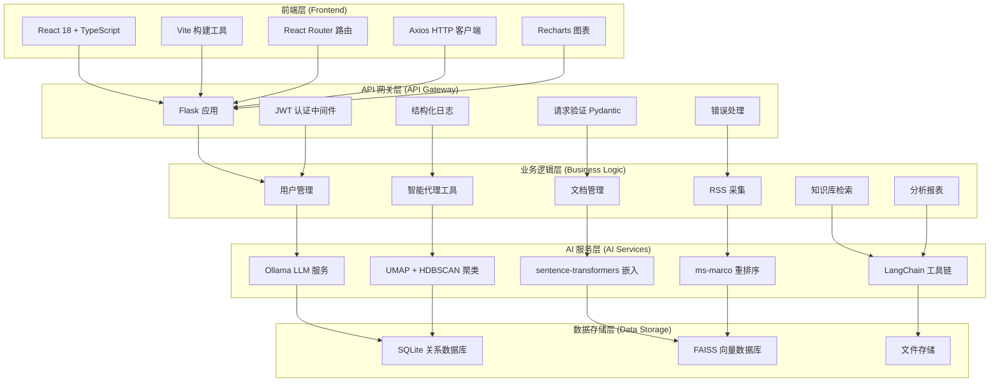
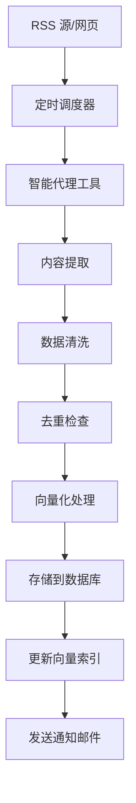
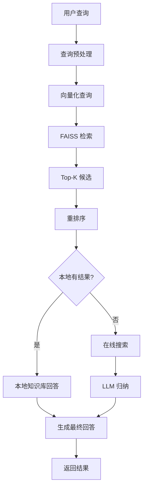
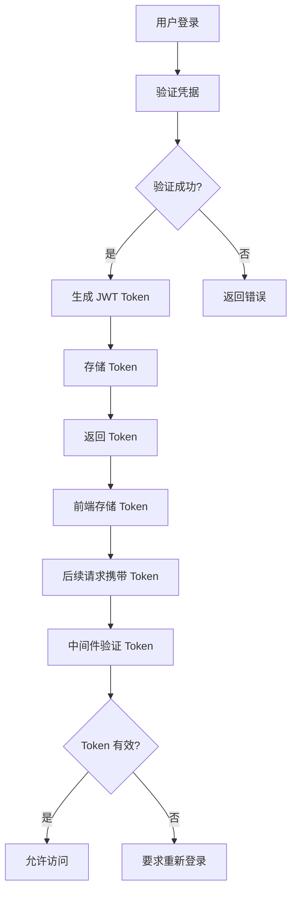
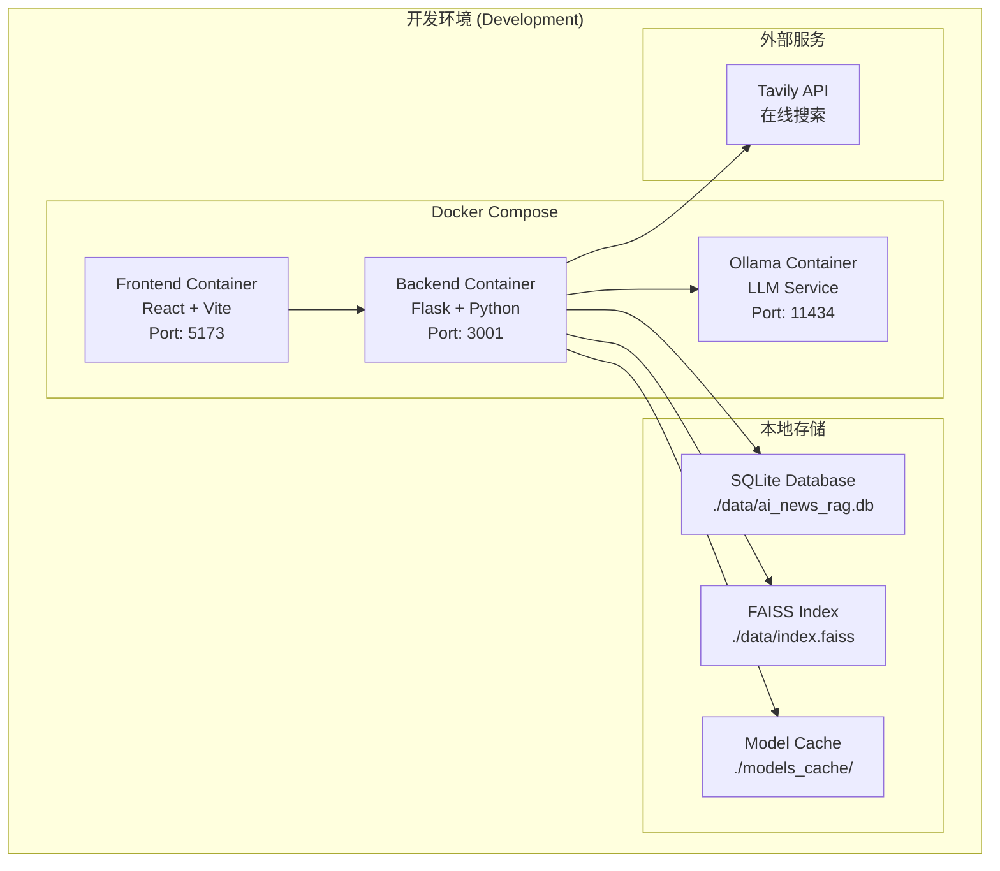
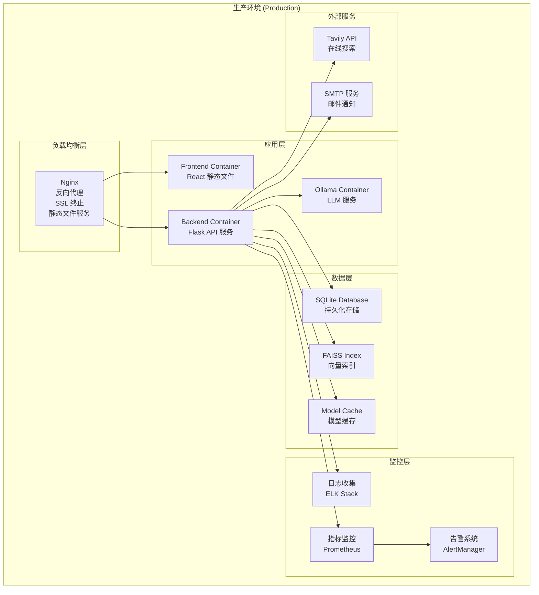
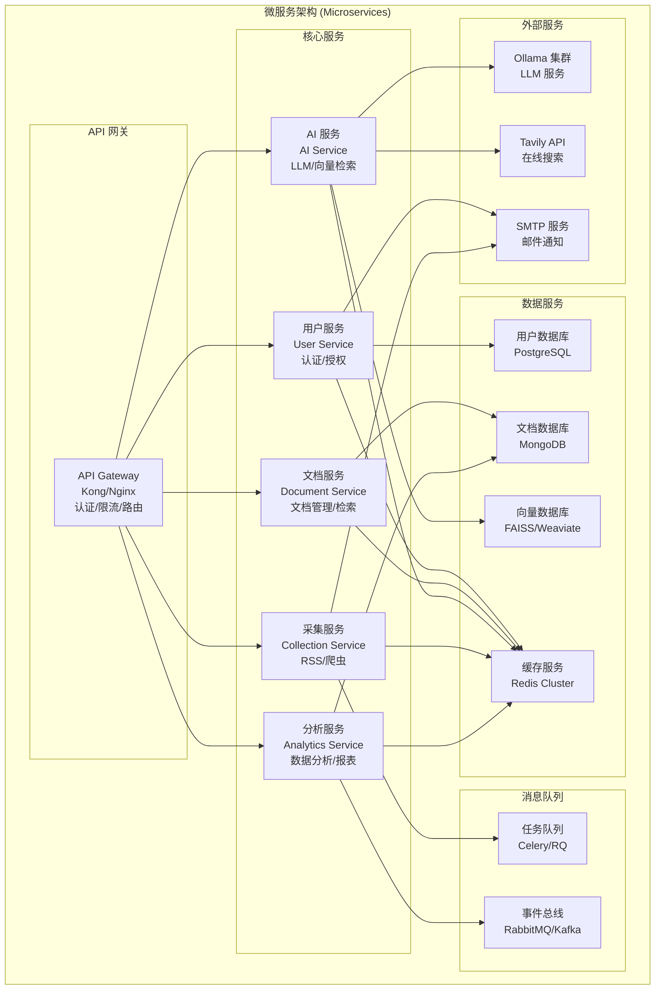

# xu-ai-news-rag 技术架构文档

## 1. 系统概述

### 1.1 产品定位
xu-ai-news-rag 是一个基于 RAG（Retrieval-Augmented Generation）技术的本地化新闻知识库系统，提供从"采集-入库-检索-分析-通知"的一体化闭环解决方案。

### 1.2 核心价值
- **本地化可控**：所有数据和处理都在本地，确保数据安全和隐私
- **智能化检索**：基于语义理解的智能检索和问答
- **自动化采集**：支持 RSS 和智能代理工具的多源数据采集
- **可扩展架构**：模块化设计，支持功能扩展和性能优化

## 2. 整体架构

### 2.1 系统架构图



### 2.2 技术栈总览

| 层级 | 技术选型 | 版本 | 说明 |
|------|----------|------|------|
| **前端** | React | 18.2.0 | 用户界面框架 |
| | TypeScript | 5.9.2 | 类型安全 |
| | Vite | 5.0.0 | 构建工具 |
| | React Router | 6.20.1 | 路由管理 |
| | Axios | 1.6.2 | HTTP 客户端 |
| | Recharts | 2.8.0 | 数据可视化 |
| **后端** | Flask | 2.3.0+ | Web 框架 |
| | SQLModel | 最新 | ORM 和数据验证 |
| | LangChain | 0.2.12+ | LLM 编排框架 |
| | Pydantic | 2.7.4 | 数据验证 |
| | JWT | 最新 | 身份认证 |
| **AI/ML** | Ollama | 最新 | 本地 LLM 服务 |
| | sentence-transformers | 2.7.0 | 文本嵌入 |
| | FAISS | 1.7.4 | 向量检索 |
| | UMAP | 最新 | 降维算法 |
| | HDBSCAN | 最新 | 聚类算法 |
| **数据存储** | SQLite | 3.40+ | 关系数据库 |
| | FAISS | 1.7.4 | 向量数据库 |
| **外部服务** | Tavily API | 0.3.3+ | 在线搜索 |
| | Playwright | 1.40.0+ | 网页抓取 |

## 3. 核心模块设计

### 3.1 前端架构

#### 3.1.1 组件结构
```
src/
├── components/          # 可复用组件
│   ├── Layout.tsx      # 主布局组件
│   └── ProtectedRoute.tsx # 路由保护
├── contexts/           # 状态管理
│   ├── AuthContext.tsx # 认证状态
│   └── ThemeContext.tsx # 主题状态
├── pages/              # 页面组件
│   ├── LoginPage.tsx   # 登录页面
│   ├── KnowledgePage.tsx # 知识库管理
│   ├── AssistantPage.tsx # AI 助手
│   ├── RssPage.tsx     # RSS 管理
│   ├── UploadPage.tsx  # 文档上传
│   └── AnalyticsPage.tsx # 分析报表
├── api/                # API 集成
│   ├── endpoints.ts    # 接口定义
│   ├── request.ts      # 请求配置
│   └── modules/        # 模块化 API
└── types/              # TypeScript 类型
    ├── api.ts          # API 类型
    ├── document.ts     # 文档类型
    └── rss.ts          # RSS 类型
```

#### 3.1.2 状态管理策略
- **Context API**：用于全局状态管理（认证、主题）
- **Local State**：组件内部状态使用 useState/useReducer
- **Server State**：通过 Axios 管理 API 状态

### 3.2 后端架构

#### 3.2.1 模块化设计
```
backend/
├── apis/               # API 蓝图
│   ├── auth.py         # 认证接口
│   ├── document.py     # 文档管理
│   ├── rss.py          # RSS 管理
│   ├── assistant.py    # AI 助手
│   └── scheduler.py    # 任务调度
├── models/             # 数据模型
│   ├── user.py         # 用户模型
│   ├── document.py     # 文档模型
│   ├── rss_source.py   # RSS 源模型
│   └── analysis.py     # 分析模型
├── utils/              # 工具函数
│   ├── jwt_utils.py    # JWT 工具
│   ├── email_sender.py # 邮件发送
│   └── logging_config.py # 日志配置
├── tools.py            # AI 工具
├── assistant.py        # 助手核心逻辑
└── app.py              # Flask 应用
```

#### 3.2.2 API 设计原则
- **RESTful**：遵循 REST 设计规范
- **版本控制**：API 版本化管理
- **错误处理**：统一的错误响应格式
- **认证授权**：JWT 基于令牌的认证
- **限流保护**：防止 API 滥用

### 3.3 AI 服务架构

#### 3.3.1 LLM 集成架构
```
┌─────────────────┐    ┌─────────────────┐    ┌─────────────────┐
│   LangChain     │    │     Ollama      │    │   qwen2.5:3b    │
│   Orchestration │◄──►│   Local Host    │◄──►│   LLM Model     │
└─────────────────┘    └─────────────────┘    └─────────────────┘
         │
         ▼
┌─────────────────┐    ┌─────────────────┐    ┌─────────────────┐
│  Tool Selection │    │  Knowledge Base │    │  Online Search  │
│  & Execution    │◄──►│     Search      │◄──►│   (Tavily)      │
└─────────────────┘    └─────────────────┘    └─────────────────┘
```

#### 3.3.2 向量检索流程
1. **文档预处理**：文本分割、清洗、标准化
2. **向量化**：使用 sentence-transformers 生成嵌入向量
3. **索引构建**：FAISS 构建高效检索索引
4. **相似度搜索**：基于余弦相似度的 Top-K 检索
5. **重排序**：使用 ms-marco 模型提升相关性

### 3.4 数据存储架构

#### 3.4.1 数据库设计
```sql
-- 用户表
CREATE TABLE user (
    id INTEGER PRIMARY KEY,
    email VARCHAR(255) UNIQUE NOT NULL,
    password_hash VARCHAR(255) NOT NULL,
    created_at TIMESTAMP DEFAULT CURRENT_TIMESTAMP
);

-- 文档表
CREATE TABLE document (
    id INTEGER PRIMARY KEY,
    title VARCHAR(500) NOT NULL,
    content TEXT NOT NULL,
    source VARCHAR(255),
    published_at TIMESTAMP,
    created_at TIMESTAMP DEFAULT CURRENT_TIMESTAMP,
    user_id INTEGER REFERENCES user(id)
);

-- RSS 源表
CREATE TABLE rsssource (
    id INTEGER PRIMARY KEY,
    name VARCHAR(255) NOT NULL,
    url VARCHAR(500) NOT NULL,
    interval_minutes INTEGER DEFAULT 60,
    is_active BOOLEAN DEFAULT TRUE,
    created_at TIMESTAMP DEFAULT CURRENT_TIMESTAMP
);

-- 分析结果表
CREATE TABLE analysis (
    id INTEGER PRIMARY KEY,
    analysis_type VARCHAR(100) NOT NULL,
    report_json TEXT NOT NULL,
    created_at TIMESTAMP DEFAULT CURRENT_TIMESTAMP
);
```

#### 3.4.2 向量存储策略
- **内存索引**：小规模数据（< 10万文档）
- **磁盘索引**：大规模数据（> 10万文档）
- **增量更新**：支持实时向量索引更新
- **备份恢复**：定期备份索引文件

## 4. 数据流设计

### 4.1 文档采集流程



### 4.2 检索问答流程



### 4.3 用户认证流程



## 5. 安全架构

### 5.1 认证与授权

#### 5.1.1 JWT 认证机制
- **Token 结构**：Header.Payload.Signature
- **过期时间**：Access Token (1小时)，Refresh Token (7天)
- **密钥管理**：环境变量存储，定期轮换
- **刷新机制**：自动刷新临近过期的 Token

#### 5.1.2 密码安全
- **哈希算法**：bcrypt，成本因子 12
- **盐值生成**：每个密码独立盐值
- **密码策略**：最小长度 8 位，包含字母数字

### 5.2 数据安全

#### 5.2.1 敏感数据保护
- **环境变量**：所有密钥通过环境变量管理
- **日志脱敏**：敏感信息不记录到日志
- **传输加密**：HTTPS 加密传输
- **存储加密**：数据库文件权限控制

#### 5.2.2 合规性考虑
- **robots.txt 遵守**：爬虫遵守网站爬取规则
- **速率限制**：避免对目标网站造成压力
- **数据来源标注**：所有内容标明来源和时间
- **版权尊重**：不爬取受限内容

### 5.3 网络安全

#### 5.3.1 API 安全
- **CORS 配置**：最小化跨域访问权限
- **速率限制**：防止 API 滥用
- **输入验证**：所有输入参数验证和清理
- **错误处理**：不暴露内部系统信息

#### 5.3.2 监控与告警
- **异常检测**：监控异常访问模式
- **日志审计**：记录所有关键操作
- **告警机制**：异常情况邮件通知
- **健康检查**：定期检查系统状态

## 6. 性能优化

### 6.1 性能指标

| 指标 | 目标值 | 监控方式 |
|------|--------|----------|
| 检索延迟 (P95) | ≤ 3s | 端到端监控 |
| 入库吞吐量 | ≥ 20 docs/min | 批处理监控 |
| 系统可用性 | ≥ 99% | 健康检查 |
| 内存使用率 | ≤ 80% | 系统监控 |
| CPU 使用率 | ≤ 70% | 系统监控 |

### 6.2 优化策略

#### 6.2.1 前端优化
- **代码分割**：按路由懒加载组件
- **缓存策略**：API 响应缓存
- **图片优化**：WebP 格式，懒加载
- **打包优化**：Tree shaking，压缩

#### 6.2.2 后端优化
- **数据库优化**：索引优化，查询优化
- **缓存机制**：Redis 缓存热点数据
- **异步处理**：耗时任务异步执行
- **连接池**：数据库连接池管理

#### 6.2.3 AI 服务优化
- **模型量化**：减少模型内存占用
- **批处理**：批量处理向量化请求
- **索引优化**：FAISS 索引参数调优
- **GPU 加速**：支持 GPU 加速推理

## 7. 部署架构

### 7.1 开发环境架构



```yaml
# docker-compose.dev.yml
version: '3.8'
services:
  frontend:
    build: ./frontend
    ports:
      - "5173:5173"
    environment:
      - VITE_API_BASE_URL=http://localhost:3001/api
    volumes:
      - ./frontend:/app
      - /app/node_modules

  backend:
    build: ./backend
    ports:
      - "3001:3001"
    environment:
      - DATABASE_PATH=/app/data/ai_news_rag.db
      - JWT_SECRET_KEY=dev_secret_key
    volumes:
      - ./backend:/app
      - ./data:/app/data

  ollama:
    image: ollama/ollama:latest
    ports:
      - "11434:11434"
    volumes:
      - ollama_data:/root/.ollama
    environment:
      - OLLAMA_HOST=0.0.0.0

volumes:
  ollama_data:
```

### 7.2 生产环境架构



```yaml
# docker-compose.prod.yml
version: '3.8'
services:
  nginx:
    image: nginx:alpine
    ports:
      - "80:80"
      - "443:443"
    volumes:
      - ./nginx.conf:/etc/nginx/nginx.conf
      - ./ssl:/etc/nginx/ssl
    depends_on:
      - frontend
      - backend

  frontend:
    build: 
      context: ./frontend
      dockerfile: Dockerfile.prod
    volumes:
      - static_files:/app/dist

  backend:
    build: 
      context: ./backend
      dockerfile: Dockerfile.prod
    environment:
      - DATABASE_PATH=/app/data/ai_news_rag.db
      - JWT_SECRET_KEY=${JWT_SECRET_KEY}
    volumes:
      - data_volume:/app/data
    depends_on:
      - ollama

  ollama:
    image: ollama/ollama:latest
    volumes:
      - ollama_data:/root/.ollama
    environment:
      - OLLAMA_HOST=0.0.0.0

volumes:
  data_volume:
  ollama_data:
  static_files:
```

### 7.3 监控与日志

#### 7.3.1 日志架构
```
┌─────────────┐    ┌─────────────┐    ┌─────────────┐
│  应用日志   │    │  系统日志   │    │  访问日志   │
│  (JSON)     │───►│  (syslog)   │───►│  (nginx)    │
└─────────────┘    └─────────────┘    └─────────────┘
        │                   │                   │
        └───────────────────┼───────────────────┘
                            ▼
                   ┌─────────────┐
                   │ ELK Stack   │
                   │ (可选)      │
                   └─────────────┘
```

#### 7.3.2 监控指标
- **应用指标**：响应时间、错误率、吞吐量
- **系统指标**：CPU、内存、磁盘、网络
- **业务指标**：用户活跃度、文档数量、检索成功率

## 8. 扩展性设计

### 8.1 水平扩展

#### 8.1.1 微服务架构图



#### 8.1.2 微服务拆分策略
- **用户服务**：独立的用户管理服务
- **文档服务**：文档存储和检索服务
- **AI 服务**：LLM 和向量检索服务
- **采集服务**：RSS 和爬虫服务
- **分析服务**：数据分析和报表生成

#### 8.1.3 负载均衡
- **Nginx**：反向代理和负载均衡
- **服务发现**：Consul 或 etcd
- **健康检查**：自动故障转移

### 8.2 垂直扩展

#### 8.2.1 数据库优化
- **读写分离**：主从数据库架构
- **分库分表**：按用户或时间分片
- **缓存层**：Redis 集群缓存

#### 8.2.2 AI 服务优化
- **模型并行**：多 GPU 并行推理
- **批处理**：批量处理请求
- **模型缓存**：预加载常用模型

## 9. 开发规范

### 9.1 代码规范

#### 9.1.1 前端规范
- **TypeScript**：严格类型检查
- **ESLint**：代码质量检查
- **Prettier**：代码格式化
- **组件命名**：PascalCase
- **文件命名**：kebab-case

#### 9.1.2 后端规范
- **PEP 8**：Python 代码规范
- **类型注解**：完整的类型提示
- **文档字符串**：Google 风格
- **错误处理**：统一的异常处理

### 9.2 测试规范

#### 9.2.1 测试覆盖率
- **单元测试**：≥ 80% 覆盖率
- **集成测试**：关键流程测试
- **端到端测试**：用户场景测试

#### 9.2.2 测试策略
- **TDD**：测试驱动开发
- **Mock**：外部依赖模拟
- **CI/CD**：自动化测试流程

## 10. 运维指南

### 10.1 部署流程

#### 10.1.1 环境准备
1. **系统要求**：Ubuntu 20.04+ / CentOS 8+
2. **依赖安装**：Docker, Docker Compose
3. **模型下载**：预下载 AI 模型
4. **配置设置**：环境变量配置

#### 10.1.2 部署步骤
1. **代码部署**：Git 拉取最新代码
2. **镜像构建**：Docker 镜像构建
3. **服务启动**：Docker Compose 启动
4. **健康检查**：验证服务状态
5. **数据迁移**：数据库初始化

### 10.2 监控运维

#### 10.2.1 日常监控
- **服务状态**：定期检查服务健康
- **性能指标**：监控关键性能指标
- **日志分析**：分析错误和异常日志
- **容量规划**：监控资源使用情况

#### 10.2.2 故障处理
- **故障定位**：通过日志快速定位问题
- **自动恢复**：配置自动重启机制
- **降级策略**：关键功能降级保护
- **备份恢复**：定期备份和恢复测试

## 11. 未来规划

### 11.1 技术演进

#### 11.1.1 短期目标 (3-6个月)
- **性能优化**：提升检索速度和准确性
- **功能完善**：完善智能代理工具
- **用户体验**：优化前端交互体验
- **监控完善**：建立完整的监控体系

#### 11.1.2 中期目标 (6-12个月)
- **微服务化**：拆分为微服务架构
- **多租户**：支持多租户部署
- **插件系统**：支持功能插件扩展
- **API 开放**：提供开放 API 接口

#### 11.1.3 长期目标 (1-2年)
- **云原生**：Kubernetes 部署
- **AI 增强**：更先进的 AI 能力
- **国际化**：多语言支持
- **生态建设**：构建开发者生态

### 11.2 技术债务

#### 11.2.1 代码质量
- **重构优化**：持续重构提升代码质量
- **文档完善**：完善技术文档和 API 文档
- **测试覆盖**：提升测试覆盖率
- **性能调优**：持续性能优化

#### 11.2.2 架构演进
- **解耦优化**：降低模块间耦合度
- **扩展性**：提升系统扩展能力
- **可维护性**：提升代码可维护性
- **可观测性**：增强系统可观测性

---

## 附录

### A. 环境变量配置

#### A.1 后端环境变量
```env
# 数据库配置
DATABASE_PATH=./data/ai_news_rag.db

# JWT 配置
JWT_SECRET_KEY=your_secret_key_here
JWT_ALGORITHM=HS256
JWT_ACCESS_TOKEN_EXPIRE_MINUTES=60

# AI 模型配置
EMBEDDING_MODEL_NAME=sentence-transformers/all-MiniLM-L6-v2
RERANK_MODEL_NAME=cross-encoder/ms-marco-MiniLM-L-6-v2
OLLAMA_BASE_URL=http://localhost:11434
OLLAMA_MODEL_NAME=qwen2.5:3b

# 向量数据库配置
FAISS_INDEX_PATH=./data/index.faiss
FAISS_PKL_PATH=./data/index.pkl

# 外部服务配置
TAVILY_API_KEY=your_tavily_api_key
TAVILY_API_URL=https://api.tavily.com

# 邮件配置
SMTP_HOST=smtp.gmail.com
SMTP_PORT=587
SMTP_USERNAME=your_email@gmail.com
SMTP_PASSWORD=your_app_password

# 日志配置
LOG_LEVEL=INFO
LOG_FILE=./logs/app.log
ERROR_LOG_FILE=./logs/error.log
```

#### A.2 前端环境变量
```env
# API 配置
VITE_API_BASE_URL=http://localhost:3001/api
VITE_USE_MOCK=false

# 应用配置
VITE_APP_TITLE=Xu AI News RAG System
VITE_APP_VERSION=1.0.0
VITE_APP_DESCRIPTION=AI-powered news retrieval and generation system
```

### B. API 接口文档

#### B.1 认证接口
```http
POST /api/auth/login
Content-Type: application/json

{
  "email": "user@example.com",
  "password": "password123"
}

Response:
{
  "access_token": "eyJ0eXAiOiJKV1QiLCJhbGciOiJIUzI1NiJ9...",
  "token_type": "bearer",
  "expires_in": 3600
}
```

#### B.2 文档管理接口
```http
GET /api/documents/page?page=1&size=20&type=all&source=all
Authorization: Bearer <token>

Response:
{
  "documents": [...],
  "total": 100,
  "page": 1,
  "size": 20,
  "pages": 5
}
```

#### B.3 AI 助手接口
```http
POST /api/assistant/query
Content-Type: application/json
Authorization: Bearer <token>

{
  "query": "什么是人工智能？",
  "use_knowledge_base": true,
  "use_online_search": true
}

Response:
{
  "answer": "人工智能是...",
  "sources": [...],
  "search_type": "knowledge_base",
  "processing_time": 1.23
}
```

### C. 数据库表结构

#### C.1 完整 SQL 脚本
```sql
-- 用户表
CREATE TABLE user (
    id INTEGER PRIMARY KEY AUTOINCREMENT,
    email VARCHAR(255) UNIQUE NOT NULL,
    password_hash VARCHAR(255) NOT NULL,
    is_active BOOLEAN DEFAULT TRUE,
    created_at TIMESTAMP DEFAULT CURRENT_TIMESTAMP,
    updated_at TIMESTAMP DEFAULT CURRENT_TIMESTAMP
);

-- 文档表
CREATE TABLE document (
    id INTEGER PRIMARY KEY AUTOINCREMENT,
    title VARCHAR(500) NOT NULL,
    content TEXT NOT NULL,
    source VARCHAR(255),
    url VARCHAR(1000),
    published_at TIMESTAMP,
    document_type VARCHAR(50) DEFAULT 'text',
    tags TEXT,
    metadata TEXT,
    user_id INTEGER REFERENCES user(id),
    created_at TIMESTAMP DEFAULT CURRENT_TIMESTAMP,
    updated_at TIMESTAMP DEFAULT CURRENT_TIMESTAMP
);

-- RSS 源表
CREATE TABLE rsssource (
    id INTEGER PRIMARY KEY AUTOINCREMENT,
    name VARCHAR(255) NOT NULL,
    url VARCHAR(500) NOT NULL,
    description TEXT,
    interval_minutes INTEGER DEFAULT 60,
    is_active BOOLEAN DEFAULT TRUE,
    last_fetched TIMESTAMP,
    created_at TIMESTAMP DEFAULT CURRENT_TIMESTAMP,
    updated_at TIMESTAMP DEFAULT CURRENT_TIMESTAMP
);

-- 分析结果表
CREATE TABLE analysis (
    id INTEGER PRIMARY KEY AUTOINCREMENT,
    analysis_type VARCHAR(100) NOT NULL,
    report_json TEXT NOT NULL,
    created_at TIMESTAMP DEFAULT CURRENT_TIMESTAMP
);

-- 创建索引
CREATE INDEX idx_document_user_id ON document(user_id);
CREATE INDEX idx_document_created_at ON document(created_at);
CREATE INDEX idx_document_source ON document(source);
CREATE INDEX idx_rsssource_is_active ON rsssource(is_active);
CREATE INDEX idx_analysis_type ON analysis(analysis_type);
```

